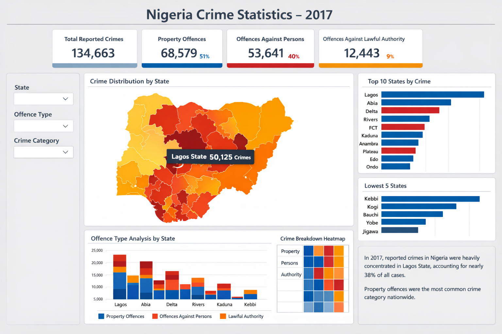

# Nigeria Crime Statistics Analysis — 2017


---

## Project Overview

This project delivers an end-to-end data analytics solution for Nigeria's 2017 national crime statistics. Using Power BI as the primary tool, raw government crime records are transformed into a structured, interactive dashboard that surfaces actionable patterns across all Nigerian states and regions.

The work demonstrates core competencies in data engineering, statistical analysis, and business intelligence — translating messy, multi-source data into clear visual narratives that support evidence-based decision-making for policymakers, researchers, and law enforcement stakeholders.

---

## Business Value & Impact

This project addresses a real-world need: making complex public safety data accessible and interpretable. Key outcomes include:

- Reduced time-to-insight for analysts reviewing state-level crime distributions
- Enabled pattern recognition across 36 states that would be impossible in raw tabular form
- Created a reusable dashboard framework applicable to future years' datasets
- Demonstrated the power of self-service BI in public sector data contexts

---

## Project Objectives

- Analyze and visualize crime trends across all Nigerian states for 2017
- Identify the most prevalent crime categories at both state and national level
- Compare regional crime distribution to surface geographic patterns
- Build a fully interactive dashboard enabling dynamic filtering and drill-down exploration
- Deliver data-driven insights to support informed public safety decision-making

---

## Dataset

The dataset comprises official crime records reported across Nigeria's 36 states for the full calendar year 2017. Each record captures the following dimensions:

| Field | Description |
|---|---|
| State | Nigerian state where the incident was reported |
| Crime Type | Category of offence (Property, Persons, Lawful Authority) |
| Number of Cases | Reported incident count per category |
| Regional Classification | Geopolitical zone (North, South, etc.) |
| Total Incidents | Aggregated count per jurisdiction |

Prior to analysis, the dataset underwent rigorous cleaning and transformation to resolve inconsistencies, standardize categorical fields, and ensure analytical integrity across all records.

---

## Tools & Technologies

| Tool | Purpose |
|---|---|
| **Power BI** | Primary platform for data visualization and interactive dashboard creation |
| **Power Query** | ETL pipeline for data ingestion, cleaning, and transformation |
| **DAX** | Authoring calculated measures, KPIs, and advanced analytical expressions |
| **GitHub** | Version control, project documentation, and portfolio presentation |

---

## Data Modeling & Engineering

A robust data model was architected to support performant, scalable analysis. The pipeline follows industry-standard BI engineering practices:

- **Data ingestion** from multiple source files into a unified Power Query pipeline
- **Systematic cleaning:** null handling, type standardization, deduplication, and field normalization
- **Dimensional modeling:** structured fact and dimension tables with clearly defined relationships
- **DAX measure library** for dynamic KPIs including total counts, percentage distributions, and state rankings
- **Query optimization** to ensure responsive dashboard performance

This architecture enables analysts to filter by any combination of state, region, or crime type without performance degradation — a key requirement for real-world BI deployment.

---

## Dashboard Preview



> **Interactive filters available:** State · Offence Type · Crime Category

---

## Dashboard Features

The interactive Power BI dashboard delivers the following analytical capabilities:

- **KPI Summary Cards** — Total reported crimes (134,663), broken down by Property Offences (51%), Offences Against Persons (40%), and Offences Against Lawful Authority (9%)
- **Crime Distribution Map** — Choropleth heatmap of Nigeria showing crime intensity by state, with tooltip drill-down (e.g. Lagos State: 50,125 crimes)
- **Top 10 States by Crime** — Horizontal bar chart ranking highest-crime states with category colour coding
- **Lowest 5 States** — Comparative view of the safest states for resource contrast analysis
- **Offence Type Analysis by State** — Stacked bar chart breaking down the three offence categories per state
- **Crime Breakdown Heatmap** — Matrix view showing offence intensity across states and categories
- **Dynamic slicers** enabling cross-filtering by State, Offence Type, and Crime Category simultaneously

---

## Key Findings

Analysis of the 2017 crime data revealed the following significant patterns:

### Geographic Concentration
> Lagos State recorded **50,125 crimes** — approximately **37% of all reported incidents nationally** — making it by far the highest-crime state. This concentration points to clear opportunities for targeted resource allocation.

### Crime Category Distribution
> **Property Offences** were the dominant crime category nationwide at **51% (68,579 cases)**, followed by Offences Against Persons at **40% (53,641 cases)**, and Offences Against Lawful Authority at **9% (12,443 cases)**.

### Top Crime States
> The top five states — **Lagos, Abia, Delta, Rivers, and FCT** — collectively account for a disproportionately large share of national crime volume, suggesting a significant urban and southern-region concentration.

### Lowest Crime States
> **Jigawa, Yobe, Bauchi, Kogi, and Kebbi** recorded the lowest crime figures, indicating notable regional disparities between northern and southern states.

---

## Repository Structure

```
Nigeria-Crime-Statistics-Analysis-2017/
│
├── dataset/
│   └── crime_data_2017.csv          # Raw source data
│
├── powerbi/
│   └── nigeria_crime_dashboard.pbix # Main Power BI report file
│
├── images/
│   └── dashboard.webp               # Dashboard preview screenshot
│
└── README.md                        # Project documentation (this file)
```

---

## Roadmap & Future Enhancements

The following enhancements are planned to extend the analytical depth and impact of this project:

- [ ] **Multi-year time series (2015–2022)** to enable longitudinal trend analysis and year-over-year comparisons
- [ ] **Predictive analytics layer** using regression modeling to forecast crime hotspots
- [ ] **Demographic integration** — population density, unemployment rates, and poverty indicators
- [ ] **Automated data refresh pipeline** for near-real-time dashboard updates
- [ ] **Public web embed** via Power BI publish-to-web for broader stakeholder access

---

## Author

**Your Name**
*Data Analyst · Power BI Developer · Business Intelligence Specialist*

Open to opportunities in data analytics, business intelligence, and data-driven product roles.

---

*Built with Power BI · Data sourced from Nigerian crime records (2017)*
